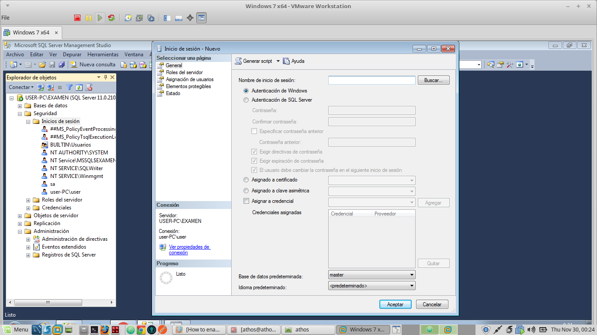
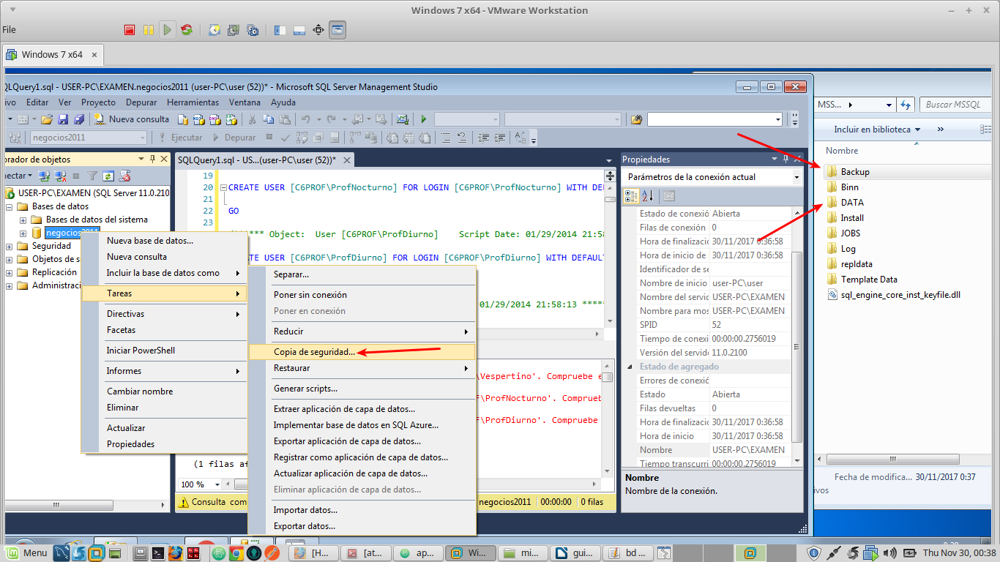
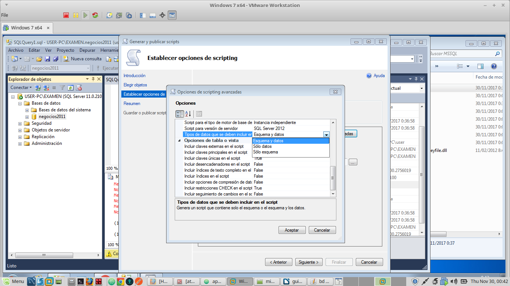
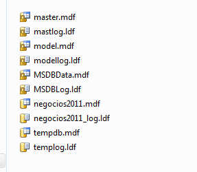
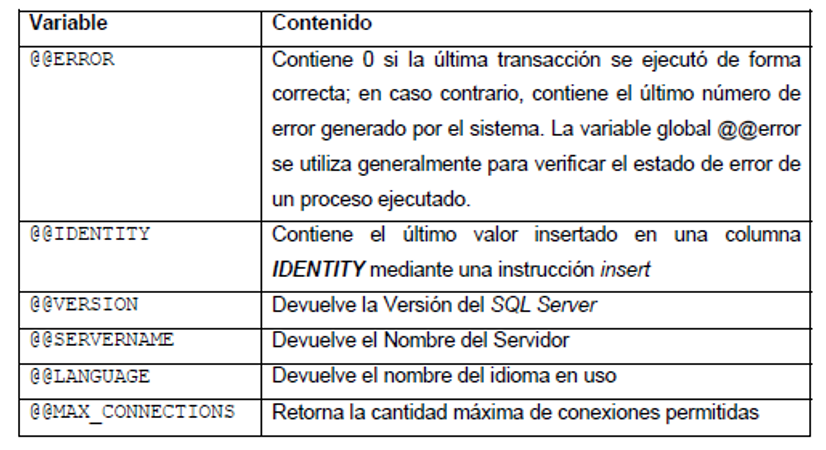
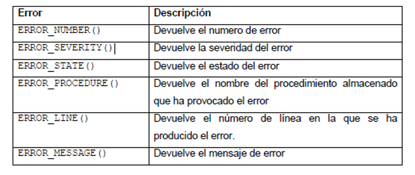

# Tipos de autenticacion

Existen dos tipos de autenticacion:
* Autenticacion de windows: los usuarios del sistema se pueden autentificar con su cuenta de usuario
* Autenticacion mixta: ademas de poderse autentificar con la cuenta de windows, tambien se crea el usuario **sa** con la contraseña que hayamos puesto.

# Instancias:

> Una instancia de Motor de base de datos es una copia del ejecutable de sqlservr.exe que se ejecuta como un servicio de sistema operativo. Cada instancia administra varias bases de datos del sistema y una o varias bases de datos de usuario.

# Creacion de usuarios

Para crear usuarios hay que ir el menú seguridad->inicios de sesion->nuevo inicio de sesion



# Copias de seguridad:

Se pueden hacer de varias formas:

* la primera es desde el menu contextual de la base de datos que queramos



Esta se guardara en el directorio backups de la instalacion de sqlserver.

* la segunda es yendo al directorio data y copiando los archivos a mano.

* la tercera es con la opcion generar scripts, pero hay que tener en cuenta si queremos solo los datos o tambien la estructura, deberemos ir a opciones avanzadas y seleccionar la opcion que queramos



# Tipos de ficheros.

Existen dos tipos de ficheros:
* los de la base de datos (.mdf)
* los ficheros de log (ldf)



# Indices y vistas:

[manual: documentacion/manual_indicesyVistas.pdf](../documentacion/manual_indicesyVistas.pdf)

## Resumen indices

* Van asociados a una tabla o a una vista
* Mejoran las consultas
* Empeoran las inserciones y actualizaciones de datos porque a parte de realizar la insercion o actualizacion tiene que actualizar el indices
* Un indice es como un objeto nuevo, como si fuese otra tabla que guarda informacion de la tabla de la que se creo el indice para, de algun modo, acelerar las consultas
* Una tabla puede tener muchos indices, pero solo uno puede ser agrupado (clustered)

> existen indices agrupados y no agrupados

.

> creadcion de indices en el manual punto 4 (con fotos)

## Resumen de vistas

Es como una tabla virtual o una consulta select

informacion de como se hace en el manual punto 6


# Tipos de datos

# Procedimientos
```sql
alter procedure numeroDePedidosYSumaDeCantidades
@total decimal(10,2) output,
@numeroDePedidos decimal(10,2) output,
@mes int = 9,
@ano int = 2012,
@idEmpleado int=1

as
	select @numeroDePedidos = COUNT(*) from ventas.pedidoscabe
	where year(ventas.pedidoscabe.fechapedido)=@ano
	and MONTH(ventas.pedidoscabe.fechapedido)=@mes
	and ventas.pedidoscabe.idempleado=@idEmpleado

	select @total = sum(ventas.pedidosdeta.preciounidad*ventas.pedidosdeta.cantidad) from ventas.pedidoscabe
	inner join ventas.pedidosdeta on ventas.pedidosdeta.idpedido = ventas.pedidoscabe.idpedido
	where year(ventas.pedidoscabe.fechapedido)=@ano
	and MONTH(ventas.pedidoscabe.fechapedido)=@mes
	and ventas.pedidoscabe.idempleado=@idEmpleado
go


declare @idEmpleado int = 1
declare @tot decimal(10,2)
declare @nped decimal(10,2)
exec numeroDePedidosYSumaDeCantidades  @tot output,@nped output

select @tot,@nped

```
# Funciones
## funcion return select
```sql
create function dbo.acumulado (@ano int) returns table
as
-- begin
	return (select top 1000 month(fechapedido) as mes,sum(ventas.pedidosdeta.cantidad) as totalunidades,sum(ventas.pedidosdeta.cantidad*ventas.pedidosdeta.preciounidad) as totaldinero,ventas.pedidosdeta.idproducto, compras.productos.NOMBREPRODUCTO
	from ventas.pedidosdeta
	inner join ventas.pedidoscabe on pedidosdeta.idpedido=pedidoscabe.idpedido
	inner join compras.productos on ventas.pedidosdeta.idproducto = compras.productos.idproducto
	where year(fechapedido)=@ano
	group by month(fechapedido),ventas.pedidosdeta.idproducto,compras.productos.NOMBREPRODUCTO
	order by 3 desc)
-- end
go

select * from dbo.acumulado(2012) ```

## funcion return tabla

```sql
CREATE FUNCTION DBO.CLIENTES() RETURNS TABLE
AS
  RETURN (SELECT IDCLIENTE AS 'CODIGO',
    NOMBRECIA AS 'CLIENTE',
    DIRECCION,
    NOMBREPAIS AS 'PAIS'
  FROM VENTAS.CLIENTES C JOIN VENTAS.PAISES P
  ON C.IDPAIS = P.IDPAIS)
GO
-- EJECUTANDO LA FUNCION
SELECT * FROM DBO.CLIENTES() WHERE PAIS='CHILE'
GO

```

## funcion return tabla creando tabla nueva

```sql
CREATE FUNCTION DBO.INVENTARIO()
RETURNS @TABLA TABLE(IDPRODUCTO INT,NOMBRE VARCHAR(50),PRECIO DECIMAL,STOCK INT)
  AS
    BEGIN
      INSERT INTO @TABLA
        SELECT IDPRODUCTO,
        NOMBREPRODUCTO,
        PRECIOUNIDAD,
        UNIDADESENEXISTENCIA
        FROM COMPRAS.PRODUCTOS
      RETURN
    END
  GO
  -- EJECUTANDO LA FUNCION
  SELECT * FROM DBO.INVENTARIO()
  GO

```

# -	Introducir clave primaria

```sql
ALTER TABLE CONTRATO
ADD PRIMARY KEY NONCLUSTERED (COD_CONT)
```

# -	Añadir clave foranea.

```sql
ALTER TABLE CONTRATO
ADD FOREIGN KEY (PROP_COD_USUA) REFERENCES PROPIETARIO

```

# crear valores default

```sql
CREATE TABLE PROPIETARIO (
  COD_USUA char(6) NOT NULL,
  TIPO_PROP varchar(30) NOT NULL
  TELEFONO_PROP char(11) DEFAULT ‘DESCONOCIDO’
)
```

# añadir default

```sql
ALTER TABLE CONTRATO
ADD DEFAULT ‘DESCONOCIDO’
FOR TELEFONO_PR

```

# solo se puede meter uno de los valores (crear condicion)

```sql
CREATE TABLE ESTADO (
  COD_EST char(6) NOT NULL,
  DESC_EST varchar(20) NOT NULL CHECK ( DESC_EST IN
  ( 'OPERATIVO', 'INOPERATIVO', 'REGULAR' ) )
)

```

# añadir condicion
```sql

ALTER TABLE ESTADO ADD CONSTRAINT CHKDESC_EST
CHECK ( DESC_EST IN ('OPERATIVO', 'INOPERATIVO', 'REGULAR')

```

# crear identity

```sql
CREATE TABLE new_empleados
(
  id_Emp int IDENTITY(1,1),
  nombreEmp varchar (20) not null,
  apePatEmp varchar(30) not null
  apeMatEmp varchar(30) not null
  sexo char(1) not null
)

```

# variables globales



# If
```sql
IF @CANTIDAD = 0
  PRINT 'EL EMPLEADO NO HA REALIZADO ALGUN PEDIDO'
ELSE IF @CANTIDAD = 1
  PRINT 'HA REGISTRADO 1 PEDIDO, CONTINUE TRABAJANDO'
ELSE
  PRINT 'HA REGISTRADO PEDIDOS'
GO

```

```sql
IF EXISTS(SELECT * FROM TB_PAISES WHERE IDPAIS = @COPAIS)
  BEGIN
    UPDATE TB_PAISES
    SET NOMBREPAIS = @NOMBRE
    WHERE IDPAIS = @COPAIS
  END
ELSE
  BEGIN
    INSERT INTO TB_PAISES VALUES (@COPAIS, @NOMBRE)
  END
GO

```

# try catch

```sql
BEGIN TRY
  DELETE FROM TB_CLIENTES
  WHERE IDCLIENTE = 'ALFKI'
END TRY
BEGIN CATCH
  IF @@ERROR=547
  PRINT 'NO SE PUEDE ELIMINAR ESTE CLIENTE'
END CATCH

```

# Errores



