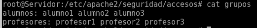
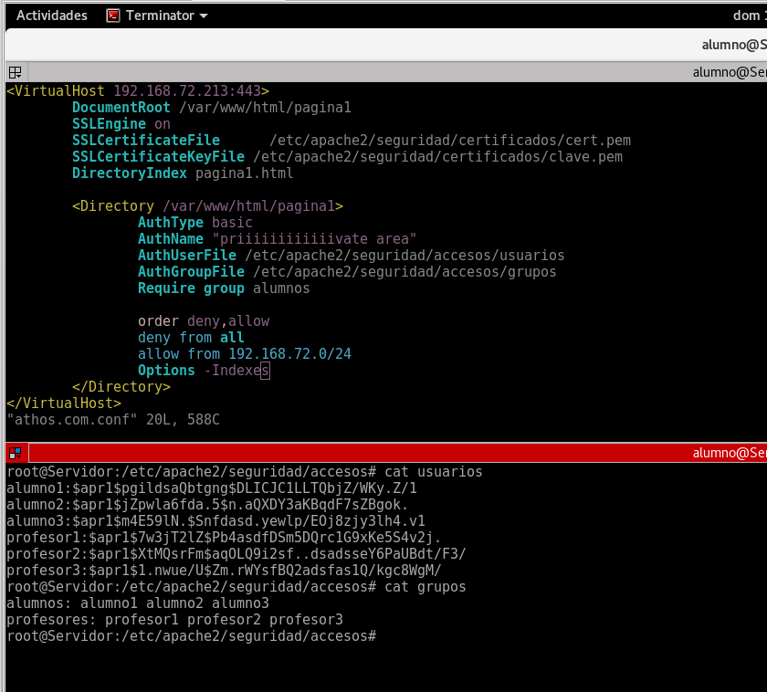
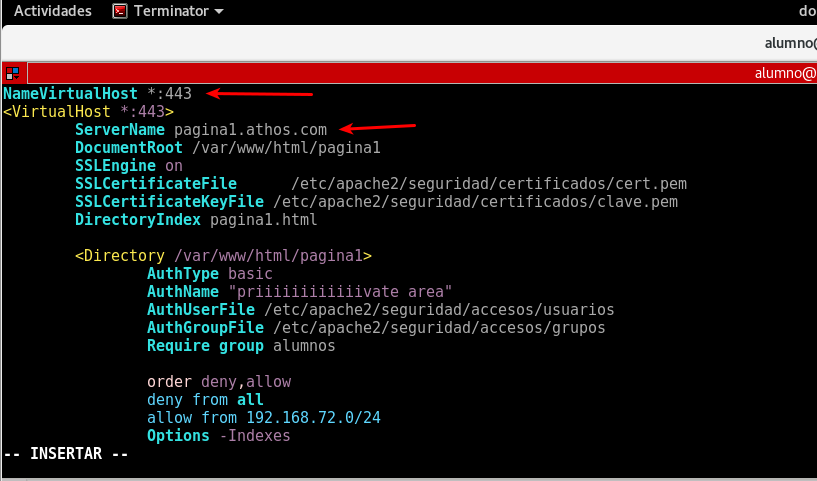
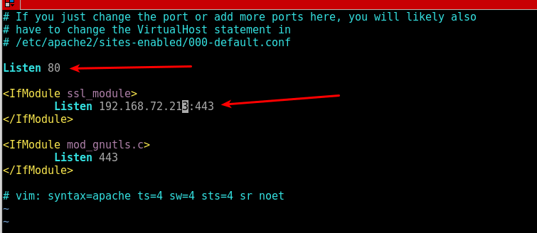

# apache
> indice
* documentacion
* configuracion basica
* denegar acceso allow deny order
* ssl https
* autenticacion usuarios
* autenticacion grupos
* ejemplo
* otras directivas
* cambiar pagina de entrada
* obligar a usar ssl
* htaccess
* option indexes
* servir dos paginas en MISMA IP Y MISMO PUERTO
* habilitar sitio
* deshabilitar sitio
* habilitar modulo
* deshabilitar modulo
* archivo ports
* logs


## documentacion

[file:///usr/share/doc/apache2-doc/manual/es/index.html](file:///usr/share/doc/apache2-doc/manual/es/index.html)

## configuracion basica

> no hay que cargar modulos

```
<VirtualHost 192.168.1.100:80>
	DocumentRoot /var/www/html/page1
</VirtualHost>
```


## denegar acceso allow deny order

> no hay que cargar modulos

* si ponemos el orden como en el ejemplo -> deny,allow deniega a todo el mundo, y

* luego permite a la red 1.0/24. si lo pusiesemos al reves, allow,deny, permitiria a la red 1.0 y seguidamente le bloquearia el acceso.

* lo importante en el orden es el **order**, como aparezca luego deny from allow from no importa

```
<Directory /var/www/html/page1>
  order deny,allow
  deny from all
  allow from 192.168.1.0/24
</Directory>
```

> by Julian

* Permitir desde cualquier IP -> Require all granted
* Denegar desde cualquier IP -> Require all denied
* Permitir solo desde la IP 192.168.10.100 -> Require ip 192.168.10.100
* No permitir desde la IP 192.168.20.100 -> Require not ip 192.168.20.100

## ssl https

> hay que cargar modulo ssl -> a2enmod ssl.load

`openssl req –nodes –x509 –newkey rsa:1024 –days 365 –keyout clave.pem –out cert.pem`

```
<VirtualHost 192.168.1.100:80 192.168.1.100:443>
	DocumentRoot /var/www/html/page1
	SSLEngine on
	SSLCertificateFile	/etc/apache2/seguridad/certificados/cert.pem
	SSLCertificateKeyFile /etc/apache2/seguridad/certificados/clave.pem
</VirtualHost>

```

## autenticacion usuarios

> no hay que cargar modulos

> si se quiere usar digest cargar modulo auth_digest.load  

`crear primer usuario: htpasswd -c archivo usuario`
`crear resto usuarios: htpasswd archivo usuario`

con la opcion -m se fuerza la encriptacion con md5

```
<VirtualHost 192.168.1.100:80 192.168.1.100:443>
	DocumentRoot /var/www/html/page1
	<Directory /var/www/html/page1>
		AuthType Basic
		AuthName "Protected Area"
		AuthUserFile /etc/apache2/seguridad/usuarios/usuarios
		Require valid-user
	</Directory>
</VirtualHost>

```

> en la directiva require se puede poner de varias formas

* `require valid-user` -> permite el acceso a todos los usuarios que esten el el archivo de usuarios
* `require user alumno1 alumno2` -> permite el acceso solo a los usuarios especificados

## autenticacion grupos

> hay que cargar modulo authz_groupfile.load

* es neceario que el AuthUserFile este cargado

[file:///usr/share/doc/apache2-doc/manual/en/mod/mod_authz_groupfile.html#authgroupfile](file:///usr/share/doc/apache2-doc/manual/en/mod/mod_authz_groupfile.html#authgroupfile)

> crear archivo de grupo y poner los grupos y los usuarios que pertenecen a cada grupo



```
<VirtualHost 192.168.1.100:80 192.168.1.100:443>
	DocumentRoot /var/www/html/page1
	<Directory /var/www/html/page1>
		AuthType Basic
		AuthName "Protected Area"
		AuthUserFile /etc/apache2/seguridad/usuarios/usuarios
    AuthGroupFile /etc/apache2/seguridad/usuarios/group
		Require group profesores
	</Directory>
</VirtualHost>

```

> resumen

 1. habilitar modulo `a2enmod authz_groupfile.load`
 1. crear archivo de grupo
 1. meter los grupos que quieres permitir separados por espacios
authgroupfile

#### ejemplo



## otras directivas

### cambiar pagina de entrada

[file:///usr/share/doc/apache2-doc/manual/en/mod/mod_dir.html#directoryindex](file:///usr/share/doc/apache2-doc/manual/en/mod/mod_dir.html#directoryindex)

`DirectoryIndex pagina1.html`

### obligar a usar ssl
[file:///usr/share/doc/apache2-doc/manual/en/mod/mod_ssl.html#sslrequiressl](file:///usr/share/doc/apache2-doc/manual/en/mod/mod_ssl.html#sslrequiressl)

> esta directiva hay que ponerla dentro de directory

`SSLrequireSSL`


### htaccess
[file:///usr/share/doc/apache2-doc/manual/es/mod/core.html#allowoverride](file:///usr/share/doc/apache2-doc/manual/es/mod/core.html#allowoverride)
> esta directiva hay que ponerla dentro de directory

* allowoverride all -> permite htaccess
* allowoverride none -> **no** permite htaccess

### option indexes
[file:///usr/share/doc/apache2-doc/manual/es/mod/core.html#options](file:///usr/share/doc/apache2-doc/manual/es/mod/core.html#options)
> esta directiva hay que ponerla dentro de directory

#### NOTA: SI NO PONES LA DIRECTIVA DENTRO DE DIRECTORY, APACHE NO DA ERROR AL REINICIAR PERO NO FUNCIONA

* options +indexes -> permite ver contenido de la carpeta
* options -indexes -> **no** permite ver contenido de la carpeta

### servir dos paginas en MISMA IP Y MISMO PUERTO

[file:///usr/share/doc/apache2-doc/manual/es/mod/core.html#namevirtualhost](file:///usr/share/doc/apache2-doc/manual/es/mod/core.html#namevirtualhost)

Para servir dos paginas direfentes en la misma ip y mismo puerto hay dos directivas relacionadas.

* `namevirtualhost` -> se pone al principio del fichero

* `servername` -> se utiliza para diferenciar una pagina de otra, esta diferenciacion la hace por dominio.



### habilitar sitio

`a2ensite nombreDelArchivoDelSitio.conf` -> NOTA: si el archivo no acaba en .conf puede dar problemas

### deshabilitar sitio

`a2dissite nombreDelArchivoDelSitio.conf` -> NOTA: si el archivo no acaba en .conf puede dar problemas

### habilitar modulo

`a2enmod nombreDelModulo`

### deshabilitar modulo

`a2dismod nombreDelModulo`

### archivo ports

`/etc/apache2/ports.conf`

En este archivo podemos decirle por que puertos escucha apache




### logs

los logs se subdividen en dos partes, logs de accesos y logs de error, se configuran de la siguiente manera:

`ErrorLog /etc/apache2/seguridad/logs/error.txt`

`CustomLog /etc/apache2/seguridad/logs/acceso.txt common`

**Nota: No olvidar poner common el el custom log**
