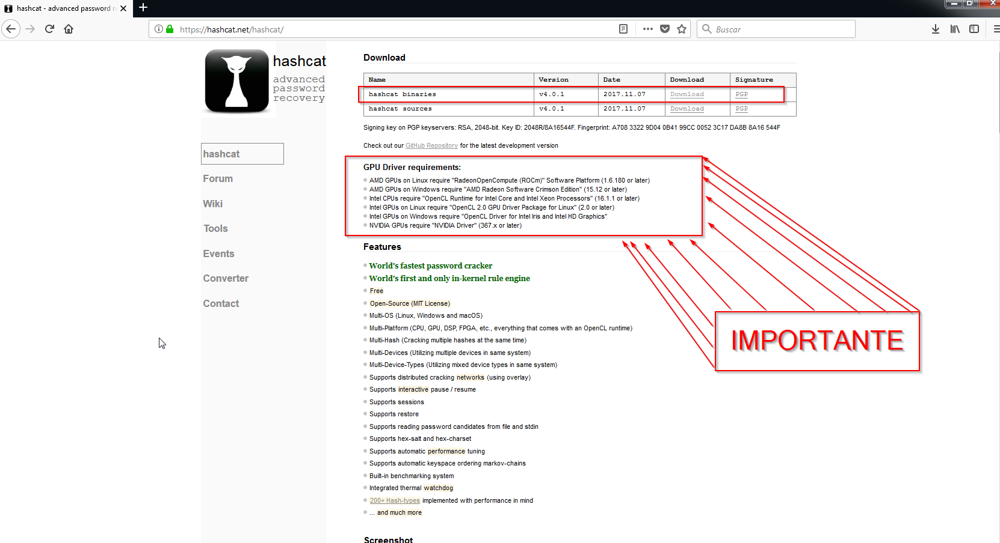
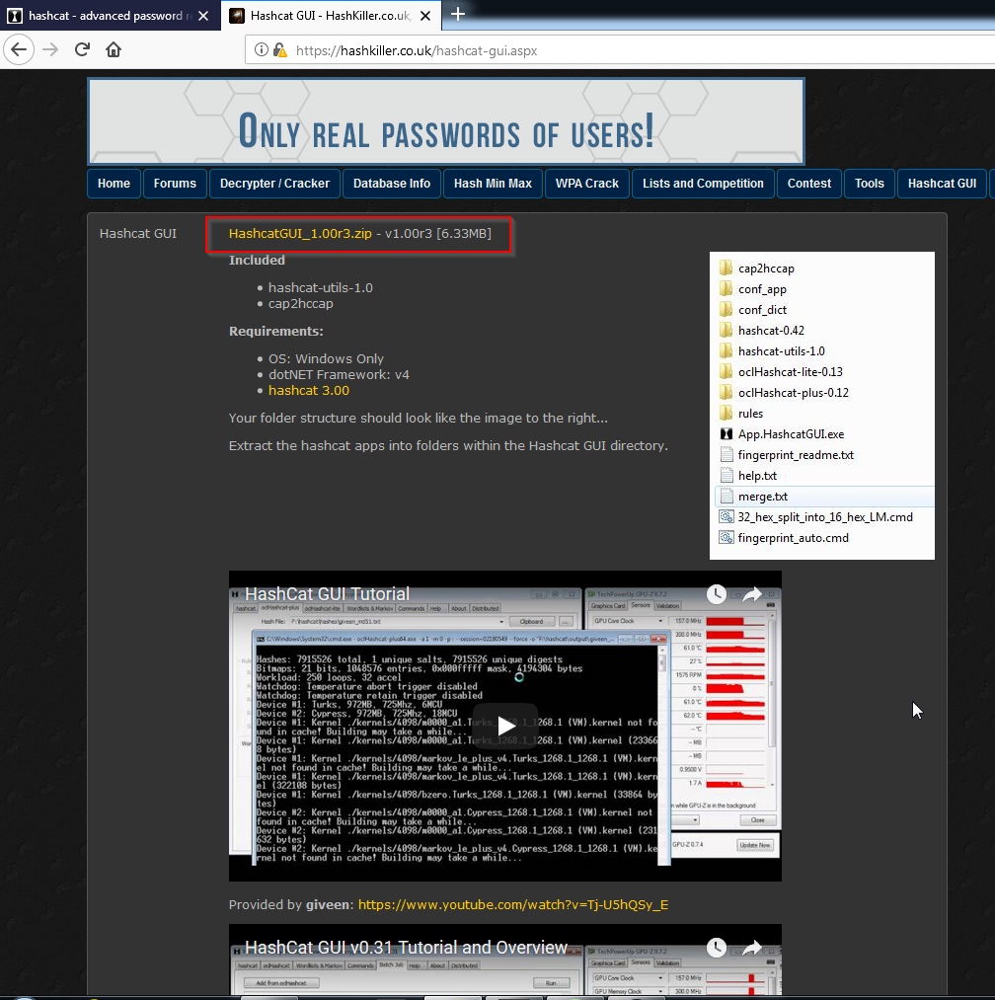
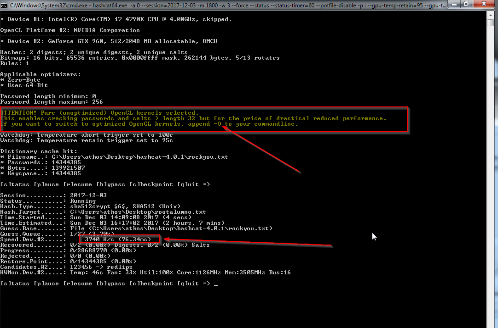
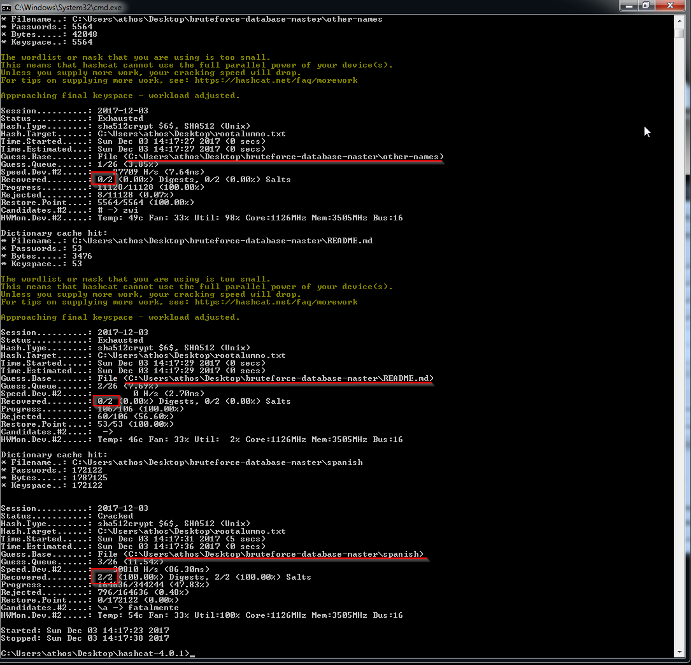
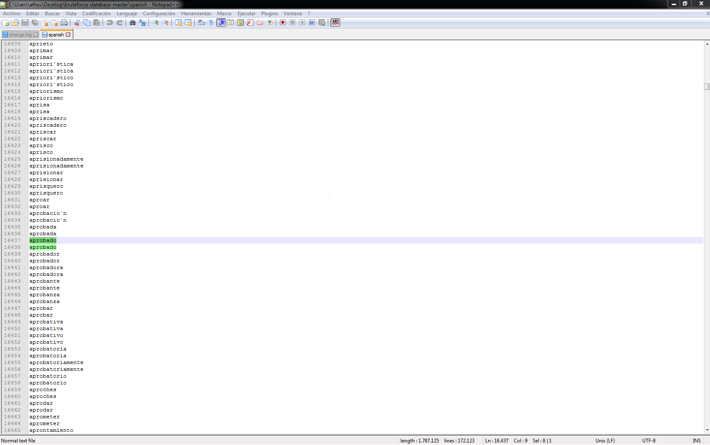
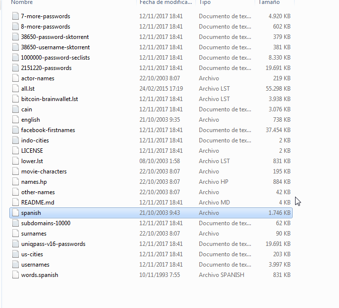

# Crackear contraseñas con hashcat.

Lo primero que vamos a hacer es descargarnos hashcat desde la pagina oficial. Debemos prestar especial atencion a los requisitos (los drivers de la tarjeta grafica), ya que una mala configuracion hará que el rendimiento sea muchisimo menor.

[Descargar hashcat](https://hashcat.net/hashcat/)



Ya podriamos usar hashcat, pero vamos a descargarnos hashcat-gui para no tener que ejecutar los comandos desde consola.

[Descargar hashcat-gui](https://hashkiller.co.uk/hashcat-gui.aspx)



Abriremos hashcat-gui y en la parte inferior, seleccionaremos la ruta al hashcat


Despues, para hacer un ataque por diccinario, seleccionaremos la pestaña wordlists y los añadiremos


Despues de esto, volveremos a la pestaña hashcat, seleccionaremos el archivo donde estan los hashes (archivo shadow de linux) y lo añadiremos a input, seleccionaremos el archivo destino y lo añadiremos a output y pincharemos en I'm a hashkiller



Como se puede ver en la imagen, nos da una alerta de que el sistema no esta funcionando del modo optimo. Más abajo, podemos comprobar que hashcat esta testeando 3740 hashes por segundo, algo que puede parecer mucho pero que no lo es.

Para solucionar esto, seguimos la recomendacion del mensaje de alerta, y vamos a añadir la opcion -O a hashcat.

Iremos a la pestaña `Custom Commands & sessions` y lo introduciremos ahi.


Volveremos a la pestaña `straight/wordlist` y volveremos a iniciar el ataque

Como podemos ver en la siguiente imagen, ya no nos aparece el mensaje de alerta, y vemos que la velocidad de calculo de hashes se ha multiplicado por 10


En la imagen podemos apreciar, como hashcat va recorriendo los diccionarios que le hemos puesto, y probando todas las combinaciones.



En los dos primeros diccionarios no ha conseguido recuperar las contraseñas, pero en el tercero si. Lo podemos ver en la linea `Recovered`

El nombre del diccionario se llama spanish, vamos a ver lo que contiene.




La contraseña estaba ahi.

> Nota: En un principio intente hacer el ataque por fuerza bruta, pero no era viable ya que se iba a demorar mucho mas del tiempo que tenia. Estuve como 15 minutos descargando diferentes diccionarios, de grupos de rock, palabras en español, nombres, apellidos etc etc. De esta manera, la contraseña la saque en menos de 2 minutos. Hay que considerar que era una contraseña extremadamente debil, y que uno de los primeros diccionarios tenia la clave.

Estos son los diccionarios que me descargue.




El resultado en el archivo de salida es el siguiente

```
$6$uJu2EHOC$QGzuOzOglIUr6t7TbyrM6ColSFysCZexLZDZ.J10UyACN455zSVnn0BIQm44M8LjggYDUYsNXSaWIsmAAx1eG1:aprobado
$6$TGpVkngA$Mz.W.BPSOJv1thFsS/vnYMi4pvNh.ePL0pH8EZ/JPmsNrKcejracp8dieTJ24HzW0h0EOIWErJOd06F0CDqle1:aprobado

```
