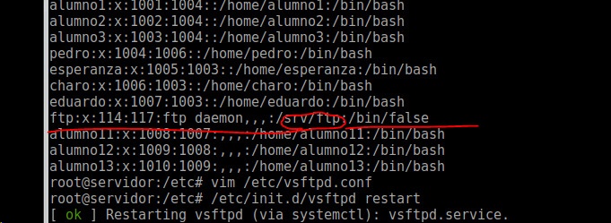

# 5.1 acl
## setfacl
añadir modificar acls

## getfacl
mostrar acls y permisos de una carpeta o archivo

## mascara
afecta al grupo propietario, a los usuarios y grupos añadidos por la acl

se usa para quitar permisos de una forma rapida sin afectar los permisos ya configurados y poder volver a ellos rapidamente.

** ejemplo: asignar a la carpeta archivos los siguietnes permisos **
* el unico que puede hacer lo que desee incluso modificar sus permisos es el root

* el grupo asir2 unicamente puede leerla

`setfacl -m g:asir2:rx archivos`

* el grupo asir1 unicamente pude ver su contenido

`setfacl -m g:asir1:rx archivos`

* el grupo profesores puede hacer ver su contenido y modificarla

`setfacl -m g:profesores:rwx archivos`

la mascara para calcular los permisos efectivos hace una "and" entre los permisos de ese
usuario o grupo y la mascara, por ejemplo

asir1 r-x mascara --- = ---

para poner la mascara a 0 -> `setfacl -m m::- archivos`

despues de poner la mascara, si asignamos un nuevo permiso, la mascara se resetea

o dicho de otra forma: en cuanto modifique los permisos de algun usuario o grupo afectado por la mascara, esta se adecua eliminando los permisos efectivos.

# 5.2 Configuracion de un servidor ftp en linux
existen distintos servidores ftp en linux, proftpd, vsftp, filezilla server, pureftp

Un servidor ftp 'suele' funcionar por los puertos:
* 21 conexion
* 20 datos

un servidor ftp puede trabajar como servidor ftp activo o pasivo.

* activo fue la forma inicial, problema si el cliente tiene activado el firewall, para solucionar esto se invento el modo pasivo.

1. el cliente inicia una conexion con el servidor con puerto por encima del 1024 al puerto 21 del servidor
1. el servidor le manda datos a traves del puerto 20 al cliente. lo normal es que el firewall del cliente corte esa conexion de vuelta, ya que es por un puerto diferente al que el cliente inicio la conexion.

* pasivo para solucionar el problema del ftp activo.

1. en este caso el cliente se conecta al servidor, y en las dos ocasiones es el cliente el que abre las conexiones, a un puerto por encima del 1024 en el servidor en la segunda ocasion. El servidor debera tener RELATED en su firewall.

## Instalacion de vsftp
### manual vsftpd.conf
* aptitude install vsftpd

* el archivo de configuracion esta en /etc/vsftpd.config
* listen=yes -> esto quiere decir que no va en inet.d sino que va por su lado

> siempre directiva=opcion **sin espacios**

* vsftpd -> comprueba el archivo de configuracion en busca de errores

* local_enable=yes -> se trabaja con usuarios locales de linux aunque podria usarse usuarios de un servidor ldap o radius

* anonimous_enable=yes

* ftpd_banner="Bienvenido a tu servidor ftp"

## Cómo limitar el acceso a determinados usuarios
> **Lista negra**

>`userlist_enable=yes` -> tiene que estar a yes para que valide userlist_file y userlist_deny

>`userlist_file=fichero` -> dentro de este fichero estan los usuarios a los que **no** se permite el acceso, los usuarios se ponen uno por linea

>**Lista blanca**
Necesita las directivas anteriores tambien

>`userlist_deny=yes/no` -> por defecto esta a yes, si lo cambiamos a no, permite solo a los del fichero dentro de este fichero estan los usuarios a los que **si** se permite el acceso. **NOTA:** en este caso, no dejaría entrar tampoco a anonimo a no ser que lo añadamos al fichero

## Enjaular a los usuarios (chroot)
> se usan tres directivas, no puede ir hacia a tras en el arbol de directorios

>`chroot_list_enable=yes` -> activamos chroot

>`chroot_list_file=fichero` -> lista de usuarios que van a ser enjaulados

> por seguridad un usuario enjaulado no debe poder escribir en la carpeta inicial a la que se conecta por ftp, si puede escribir no le dejara conectarse

> En el manual, revisar la directiva chroot_list_file porque esta mas clara qeu esta chroot_local_user

> chroot_local_user=yes/no --> por defecto esta **no**

> * no -> de esta forma enjaula a los del fichero,
> * si -> no enjaula a los del fichero

## Como cambiar de directorio inicial

> `local_root=directorio` -> manda a todos los usuarios locales **(menos el anonimo)** a ese directorio

.

> el usuario que usa para conectar como anonimo es el usuario ftp del servidor

> anon_root=ruta -> carpeta a donde redirige al conectarse como usaurio anonimo
