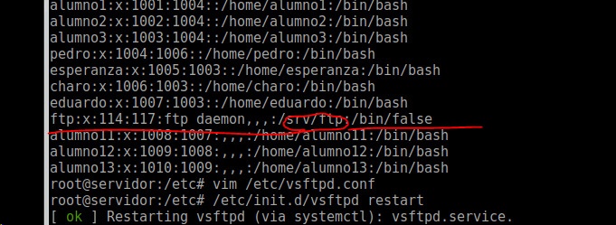

<!-- TOC START min:1 max:3 link:true update:true -->
- [5.1 acl](#51-acl)
  - [setfacl](#setfacl)
  - [getfacl](#getfacl)
  - [mascara](#mascara)
- [5.2 Configuracion de un servidor ftp en linux](#52-configuracion-de-un-servidor-ftp-en-linux)
  - [Instalacion de vsftp](#instalacion-de-vsftp)
    - [manual vsftpd.conf](#manual-vsftpdconf)
  - [Cómo limitar el acceso a determinados usuarios](#cmo-limitar-el-acceso-a-determinados-usuarios)
  - [Enjaular a los usuarios (chroot)](#enjaular-a-los-usuarios-chroot)
  - [Como cambiar de directorio inicial](#como-cambiar-de-directorio-inicial)
  - [Permisos de ficheros.](#permisos-de-ficheros)
  - [Comandos adicionales](#comandos-adicionales)
  - [ftp por ssl](#ftp-por-ssl)
  - [ftp explicito e implicito](#ftp-explicito-e-implicito)

<!-- TOC END -->

# 5.1 acl
## setfacl
añadir modificar acls

## getfacl
mostrar acls y permisos de una carpeta o archivo

## mascara
afecta al grupo propietario, a los usuarios y grupos añadidos por la acl

se usa para quitar permisos de una forma rapida sin afectar los permisos ya configurados y poder volver a ellos rapidamente.

** ejemplo: asignar a la carpeta archivos los siguietnes permisos **
* el unico que puede hacer lo que desee incluso modificar sus permisos es el root

* el grupo asir2 unicamente puede leerla

`setfacl -m g:asir2:rx archivos`

* el grupo asir1 unicamente pude ver su contenido

`setfacl -m g:asir1:rx archivos`

* el grupo profesores puede hacer ver su contenido y modificarla

`setfacl -m g:profesores:rwx archivos`

la mascara para calcular los permisos efectivos hace una "and" entre los permisos de ese
usuario o grupo y la mascara, por ejemplo

asir1 r-x mascara --- = ---

para poner la mascara a 0 -> `setfacl -m m::- archivos`

despues de poner la mascara, si asignamos un nuevo permiso, la mascara se resetea

o dicho de otra forma: en cuanto modifique los permisos de algun usuario o grupo afectado por la mascara, esta se adecua eliminando los permisos efectivos.

# 5.2 Configuracion de un servidor ftp en linux
existen distintos servidores ftp en linux, proftpd, vsftp, filezilla server, pureftp

Un servidor ftp 'suele' funcionar por los puertos:
* 21 conexion
* 20 datos

un servidor ftp puede trabajar como servidor ftp activo o pasivo.

* activo fue la forma inicial, problema si el cliente tiene activado el firewall, para solucionar esto se invento el modo pasivo.

1. el cliente inicia una conexion con el servidor con puerto por encima del 1024 al puerto 21 del servidor
1. el servidor le manda datos a traves del puerto 20 al cliente. lo normal es que el firewall del cliente corte esa conexion de vuelta, ya que es por un puerto diferente al que el cliente inicio la conexion.

* pasivo para solucionar el problema del ftp activo.

1. en este caso el cliente se conecta al servidor, y en las dos ocasiones es el cliente el que abre las conexiones, a un puerto por encima del 1024 en el servidor en la segunda ocasion. El servidor debera tener RELATED en su firewall.

## Instalacion de vsftp
### manual vsftpd.conf
* aptitude install vsftpd

* el archivo de configuracion esta en /etc/vsftpd.conf
* listen=yes -> esto quiere decir que no va en inet.d sino que va por su lado

> siempre directiva=opcion **sin espacios**

* vsftpd -> comprueba el archivo de configuracion en busca de errores

* local_enable=yes -> se trabaja con usuarios locales de linux aunque podria usarse usuarios de un servidor ldap o radius

* anonymous_enable=yes

* ftpd_banner="Bienvenido a tu servidor ftp"

## Cómo limitar el acceso a determinados usuarios
> **Lista negra**

>`userlist_enable=yes` -> tiene que estar a yes para que valide userlist_file y userlist_deny

>`userlist_file=fichero` -> dentro de este fichero estan los usuarios a los que **no** se permite el acceso, los usuarios se ponen uno por linea

>**Lista blanca**
Necesita las directivas anteriores tambien

>`userlist_deny=yes/no` -> por defecto esta a yes, si lo cambiamos a no, permite solo a los del fichero dentro de este fichero estan los usuarios a los que **si** se permite el acceso. **NOTA:** en este caso, no dejaría entrar tampoco a anonimo a no ser que lo añadamos al fichero

## Enjaular a los usuarios (chroot)
> se usan tres directivas, no puede ir hacia a tras en el arbol de directorios

>`chroot_list_enable=yes` -> activamos chroot

>`chroot_list_file=fichero` -> lista de usuarios que van a ser enjaulados

> por seguridad un usuario enjaulado no debe poder escribir en la carpeta inicial a la que se conecta por ftp, si puede escribir no le dejara conectarse

> En el manual, revisar la directiva chroot_list_file porque esta mas clara qeu esta chroot_local_user

> chroot_local_user=yes/no --> por defecto esta **no**

> * no -> de esta forma enjaula a los del fichero,
> * si -> no enjaula a los del fichero

## Como cambiar de directorio inicial

> `local_root=directorio` -> manda a todos los usuarios locales **(menos el anonimo)** a ese directorio

.

> el usuario que usa para conectar como anonimo es el usuario ftp del servidor

> anon_root=ruta -> carpeta a donde redirige al conectarse como usaurio anonimo

## Permisos de ficheros.

Hay que tener muy en cuenta los permisos locales.

Los permisos que se usan son los del sistema local, o bien los permisos normales o bien acls

Tenemos permisos de:
* Descarga -> `download_enable` por defecto está a **si** lo que permite la descarga. Si está a no, no permite la descarga.

* Subida -> `write_enable` por defecto está a **no** lo que no permite la subida de archivos. Si la ponemos a si, dejara subir archivos a los que tengan permisos para escribir en esa carpeta.

* Para los usuarios anonimo podemos permitir que suban ficheros **(crear carpetas NO)** si habilitamos `anon_upload_enable` siempre y cuando **write_enable** esté habilitado.

* Si queremos que anonimo pueda crear directorios deberemos poner la directiva `anon_mkdir_write_enable` -> la directiva write_enable debe estar a yes, siempre y cuando pueda escribir en directorio (recordemos que el usuario anónimo es el usuario **ftp**)

>
  **NOTA: SI ENJAULAMOS EL SERVIDOR FTP Y DAMOS PERMISOS DE ESCRITURA EN LA CARPTA DE LA 'JAULA' NO NOS VA A DEJAR CONECTARNOS DE NINGUNA MANERA**

* `local_umask` -> sirve para cambiar la mascara, es decir, para fijar los permisos con los que se crean o se suben los ficheros de los usuarios locales. Si ponemos mascara 044 los permisos que se crearan son 733 **NOTA: aunque demos permisos de ejecución, LOS ARCHIVOS se crearan sin ejecución** en el ejemplo anterior los permisos reales en ficheros serían 622

* `anon_umask` ->  igual que `local_umask` pero para usuario anonimo

## Comandos adicionales

* `listen_address` = ip -> dirección ip del servidor por la que se escuchará peticiones ftp. Sólo se puede poner una ip

* `max_clients` -> número de clientes que pueden conectarse simultaneamente.

* `local_max_rate` = x -> indica los bytes/segundo permitidos por usuario.

* `anon_max_rate` -> lo mismo que `local_max_rate` pero para usuario anónimo

* `xferlog_enable` -> por defecto esta a **no** si se pone a yes, activa los logs en `/var/log/vsftpd.log`

## ftp por ssl

* lo primero es crear los certificados con `openssl req -x509 -nodes -newkey rsa:1024 -days 365 -keyout clave.pem -out cert.pem`

* ssl_enable por defecto está a **no**

> como hemos usado el algoritmo rsa, tendremos que utilizar las siguientes directivas:

* `rsa_cert_file=ruta`

* `rsa_private_key_file=ruta`

* `force_local_data_ssl=yes/no` -> por defecto estan a **si** -> fuerza los datos por ssl

* `force_local_login_ssl=yes/no`-> por defecto estan a **si** -> fuerza el login por ssl

* `allow_anon_ssl=yes/no` -> por defecto está a no (lo que no permite acceso por ssl a usuario anonimos)

* `force_anon_logins_ssl=yes/no` -> fuerza que el login del usuario anonimo vaya por ssl

* `force_anon_data_ssl=yes/no` -> fuerza que los datos del usuario anonimo vaya por ssl

`force_anon_ssl` y `force_anon_data_ssl` **no** dependen del valor de la directiva `allow_anon_ssl`

## ftp explicito e implicito

El explicito *suele* ir por el puerto 21 y el implicito *suele* ir por el puerto 990.

**Por defecto es explicito**

`implicit_ssl` -> si está esta directiva solo se puede conectar de forma implícita, si no está esta directiva solo se podría conectar de forma explícita.

Explícito, se establece la conexión y luego se intercambian los certificados

Implícito (mas seguro) no se establece la comunicación hasta que no se intercambia el certificado

`listen_port=puerto` -> puerto por el que escucha el servidor
