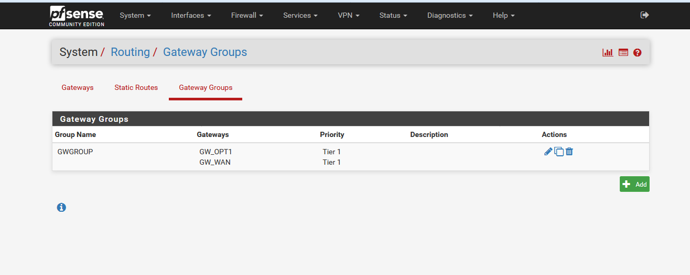

# Balanceo de red con pfsense

Para la práctica siguiente vamos a montar el siguiente esquema:

En el lado derecho, vemos dos enrutadores con ips 192.168.2.2 y 192.168.3.2. En este caso son dos servidores windows 2008 con el servicio de enrutador, pero podría servir cualquier otro tipo de enrutador.

En el medio, tenemos el pfsense, que se encargara de distribuir el trafico por los dos enrutadores.

En el lado izquierdo, vemos un cliente con windows 7 con el que haremos diferentes pruebas y configuraremos el pfsense mediante el interface web.

Una vez instalado pfsense, añadiendo a la maquina virtual las correspondientes tarjetas de red, configuraremos las direcciones ips de cada una de ellas. Para esto, utilizaremos los menus que nos proporciona pfsense:

Lo primero que tendremos que hacer es asignar los interfaces con la opcion 1. Nos preguntara que interface es el lan, y cual (o cuales) el wan.

Después de esto, con la opción 2 asignaremos las direcciones ips a cada uno de los interfaces, dejandolo como se muestra en la imagen anterior.

Ahora, vamos a conectarnos al interface web de pfsense, y entraremos en system->routing, podremos ver nuestras dos gateways, modificaremos cada una de ellas y configuraremos la opción monitor ip, que sirve para que pfsense monitorizar el estado de ese gateway. Deberemos poner una ip diferente en cada una de las gateways.

Ahora, iremos a la opcion gateway groups y crearemos un nuevo grupo de gateways.

Como podemos ver, hemos puesto prioridad tier1 en las dos gateways, esto hará que utilice las dos siempre que sea posible, y si una de las dos cae, seguirá usando la otra.

Si ponemos una de las dos gateways como tier2 por ejemplo, sólo utilizaria la de tier mayor mientras este disponible, y usará la otra sólo cuando la que tenga el tier con mas prioridad caiga.

Ahora, solo nos queda modificar las reglas del firewall que trae pfsense por defecto para decirle que utilice el grupo de gateways en vez del gateway por defecto.

Iremos a firewall->rules y entraremos en la pestaña lan, ahi modificaremos la regla ipv4

Como vemos en la imagen anterior, hemos cambiado el gateway de la regla y hemos seleccionado el grupo de gateways que creamos anteriormente.

Ahora, solo nos queda probar si nos funciona el balanceo.

[pruebaBalanceoRed.gif](assets/monitorizacionBalanceo.gif)

[trafic-graph.gif](assets/pruebaBalanceoRed.gif)

