# Raid5

Lo primero que tendremos que hacer es añadir 3 discos a la máquina virtual.

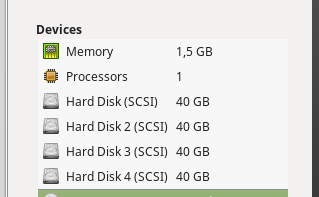

Ahora, en w2008, iremos a administración de discos y crearemos el raid 5

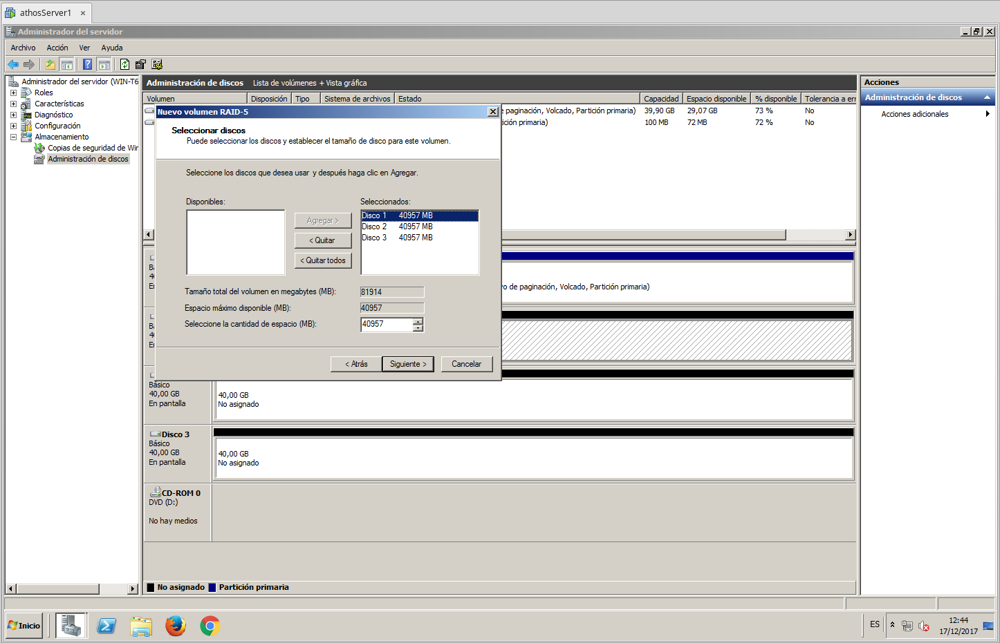

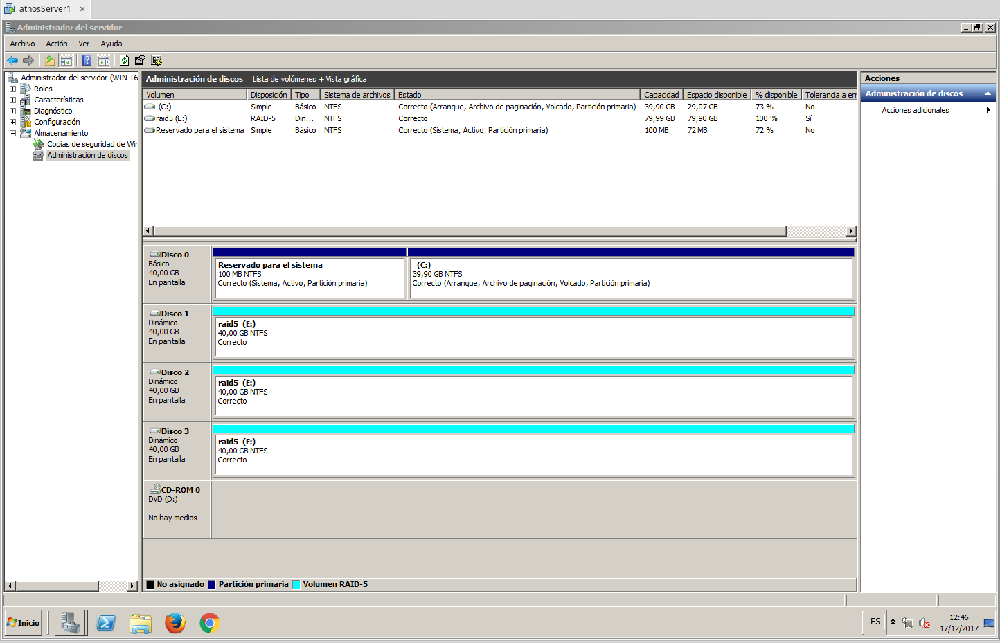

Metemos información en el disco para las pruebas.

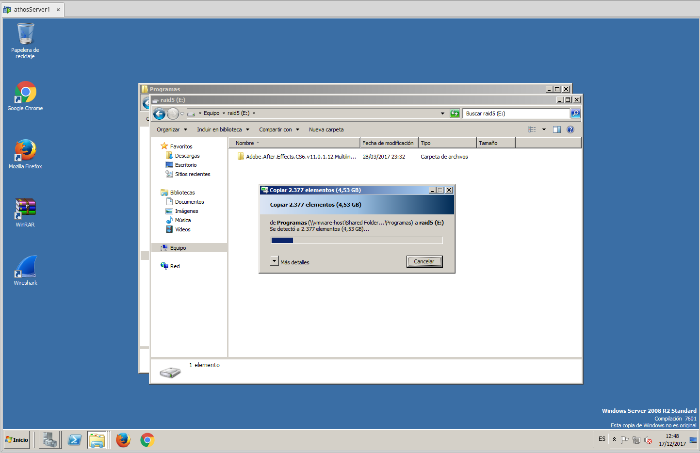

Quitamos un disco de los del raid para provocar un fallo.

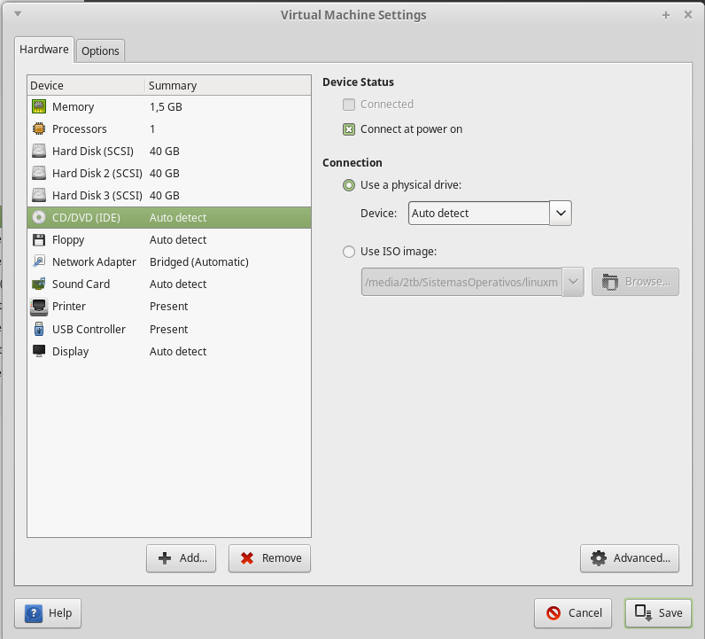

Ahora arrancamos el sistema, y podemos ver que seguimos teniendo los datos, aunque en el administrador de discos nos da un error de redundancia en el raid5. Tambien podemos comprobar que podemos seguir metiendo datos

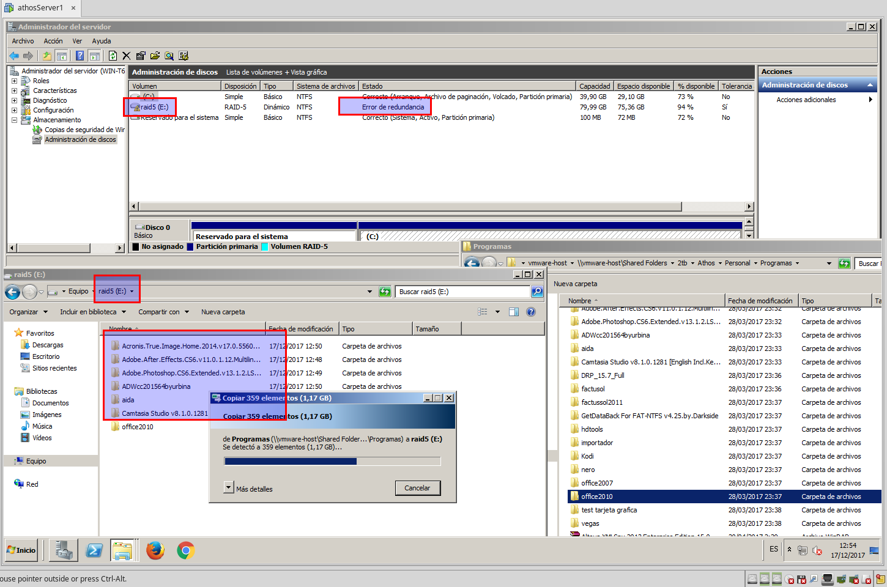

Añadimos un nuevo disco a la vm para reparar el raid5

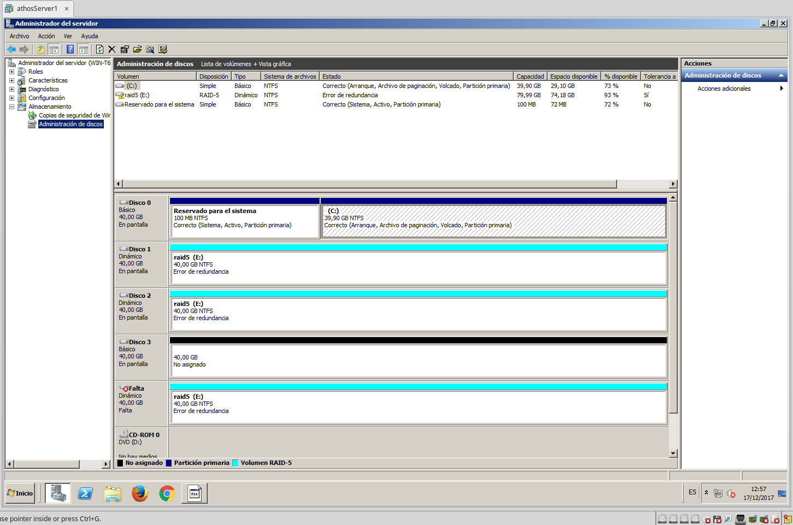

Pincharemos con el boton derecho en uno de los discos del raid, y seleccionaremos reparar volumen

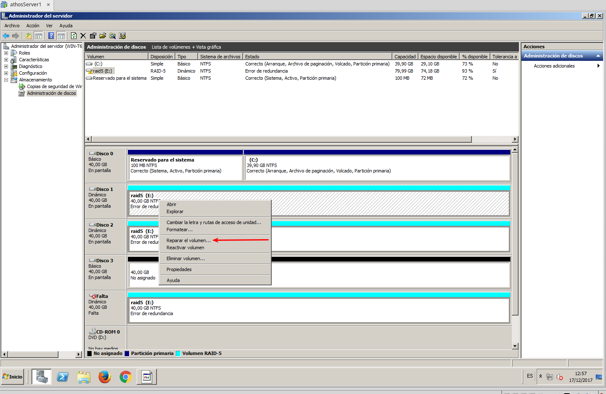

En este caso, solo tenemos un disco adicional, asi que nos saldra una ventana para elegir disco, pero en este caso solo tiendremos uno donde elegir.

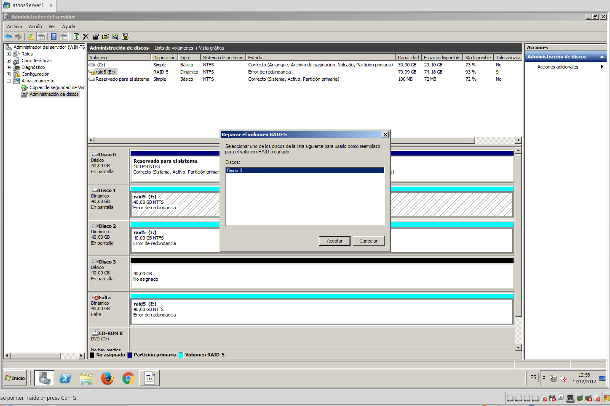

Nos cogerá el disco y podremos comprobar que los vuelve a sincronizar, reparando asi el raid

# Redundancia apache

Vamos a configurar la tarjeta de red del servidor maestro

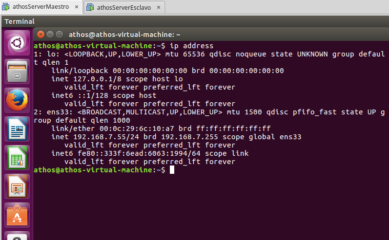

Y tambien del servidor esclavo

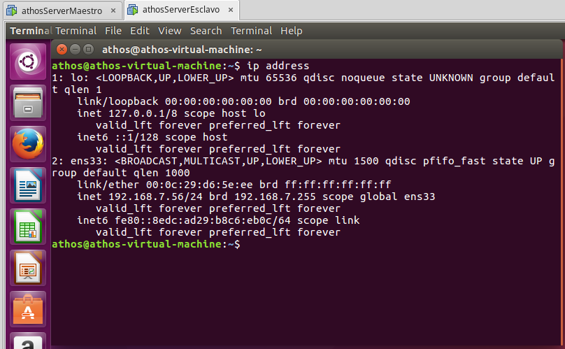

Instalamos apache2 en los dos servidores y comprobamos si funciona en local, modificaremos las páginas por defecto para comprobar a que servidor estamos accediendo.

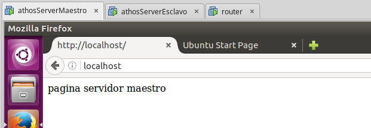

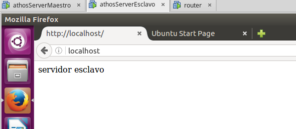

Instalamos ucarp en las dos maquinas

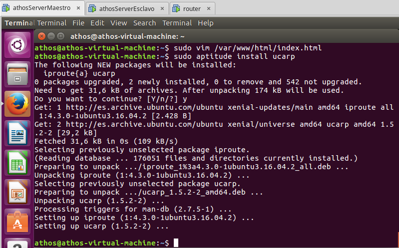

Y configuramos los interfaces

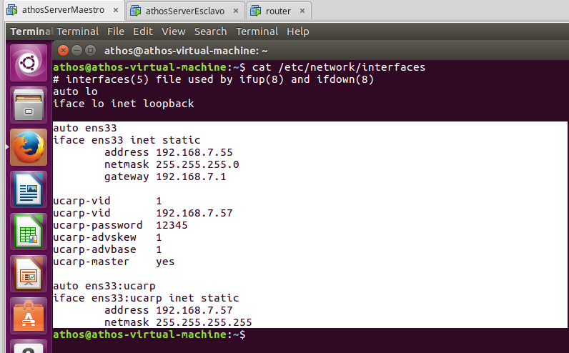

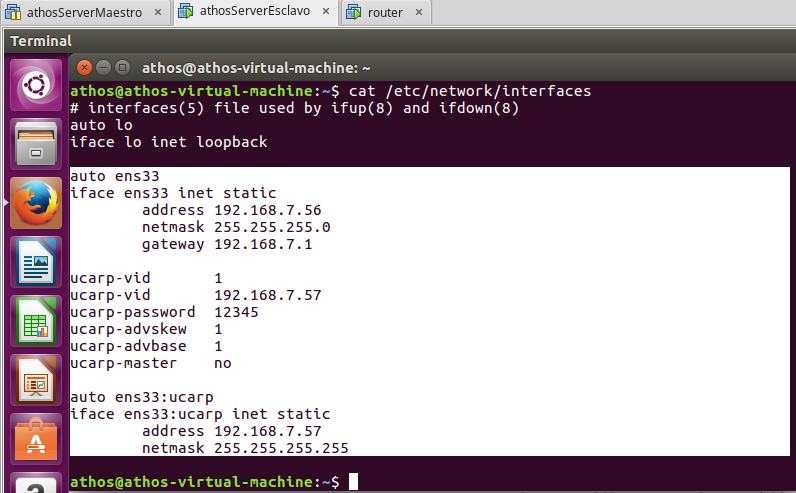

Si los dos servidores estan activos, vemos que poniendo la direccion ip 192.168.7.57 nos carga la pagina del maestro

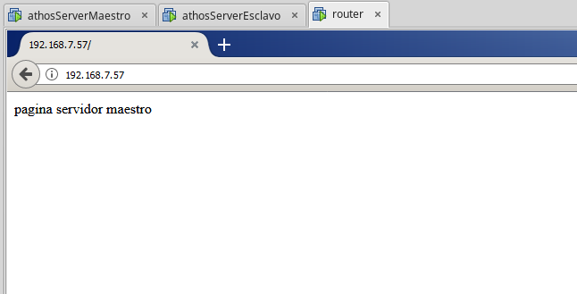

Si tiramos el servidor maestro, vemos que nos carga la pagina del esclavo

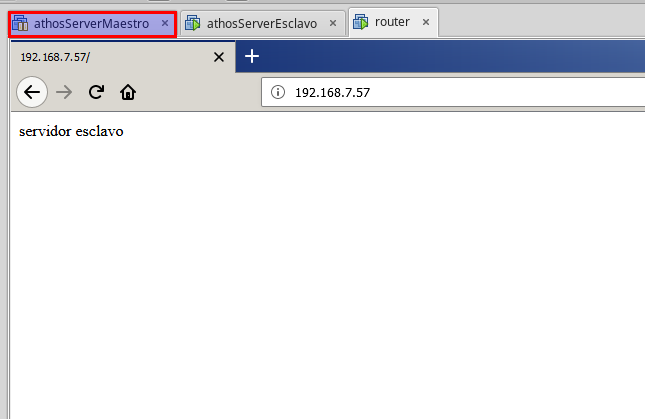

# Práctica voluntaria balanceo con pfsense

https://youtu.be/P38ZdFWS-ew
