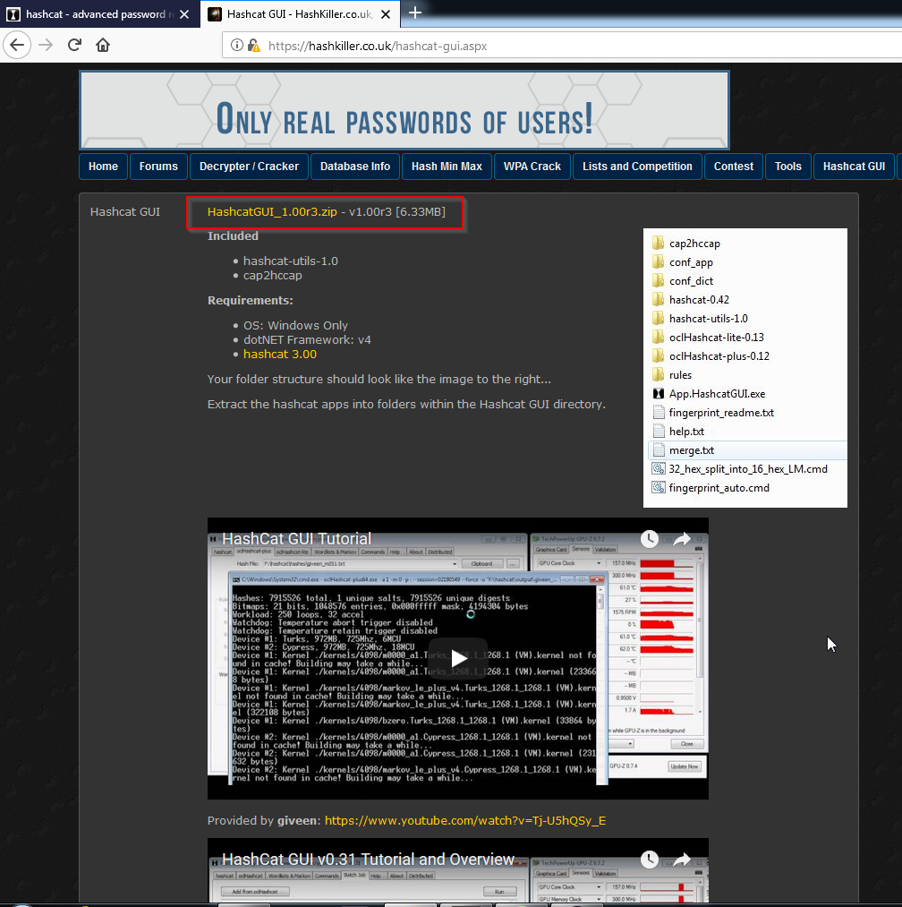
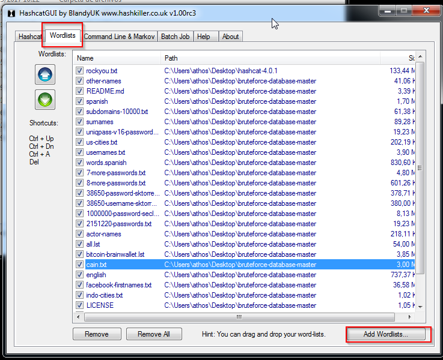
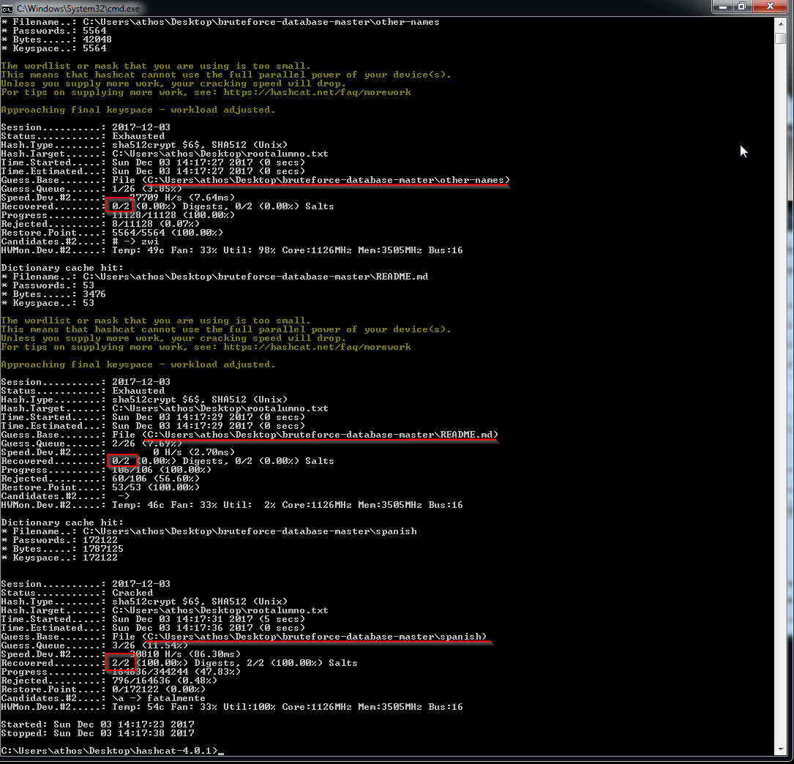
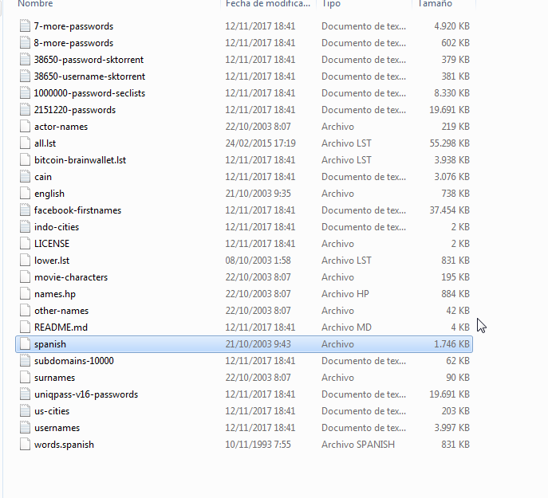

<!-- TOC depthFrom:1 depthTo:6 withLinks:1 updateOnSave:1 orderedList:0 -->

- [Práctica voluntaria Ejercicios de tema 3: Seguridad lógica](#practica-voluntaria-ejercicios-de-tema-3-seguridad-lgica)
- [Añadido: crackeando con hashcat](#aadido-crackeando-con-hashcat)

<!-- /TOC -->
# Práctica voluntaria Ejercicios de tema 3: Seguridad lógica

En esta práctica vamos a desencriptar las contraseñas de una máquina linux. Para ello lo vamos a hacer con la herramienta john the ripper (de aquí en adelante 'john').

Vamos a ver la diferencia entre usar el john que te descargas directamente desde los repositorios con respecto a descargarnoslo de la página oficial y compilarlo cambiando alguna cosa.

Metemos los hashes en un archivo


ejecutamos el comando `john pass.practica.charo.voluntaria`

  

Si pulsamos cualquier tecla menos la `q` o `ctrl+c` veremos el estado por el que va el crackeo


Como vemos que va a tardar mucho, vamos a descargar un diccionario y probaremos con él, aunque como podemos ver, nos ha sacado una de las dos contraseñas


Vamos a intentar sacar la otra con ataque de diccionario.


Descargarmos el rockyou y podemos comprobar que tiene mas de 14 millones de contraseñas


Y ejecutaremos john de la siguiente forma

`john --wordlist=rockyou.txt pass.practica.charo.voluntaria`


Como vemos en la imagen anterior, john nos guarda la contraseña que sacó anteriormente, si quisieramos verla tendriamos que usar el parametro `--show`

No hemos tenido suerte, no la ha sacado, tendriamos que probar con otros diccionarios o de forma incremental.


Editamos el archivo de configuración de john para añadir un nuevo modo incremental, en el que le vamos a decir que busque contraseñas solo de 1 a 4 caracteres


Ahora ejecutamos john con nuestro nuevo modo incremental.


Y como vemos en la imagen anterior conseguimos la contraseña.

Si lo quisieramos hacer con hashcat, sería de la siguiente manera:


Esto nos guardara la contraseña en el archivo `testresult.txt`. Lo ejecutamos:

En la siguiente imagen, nos podemos fijar, en que `guest-queue` es el 'paso' por el que va. Como hemos puesto que la longitud máxima sea 4 caracteres (`?1?1?1?1` -> cada ?1 representa un caracter con charset ?l?d (es decir, letras mayusculas y minusculas)) está ya haciendo el cálculo de 3 caracteres, y vemos que ha sacado 1 de las dos contraseñas como podemos apreciar en `Recovered`. Si vamos al archivo que pusimos de output (`testresult.txt`) veremos que tenemos la contraseña.


Archivo `testresult.txt`:


# Añadido: crackeando con hashcat

Lo primero que vamos a hacer es descargarnos hashcat desde la página oficial. Debemos prestar especial atención a los requisitos (los drivers de la tarjeta gráfica), ya que una mala configuracion hará que el rendimiento sea muchísimo menor.

[Descargar hashcat](https://hashcat.net/hashcat/)


Ya podríamos usar hashcat, pero vamos a descargarnos hashcat-gui para no tener que ejecutar los comandos desde consola.

[Descargar hashcat-gui](https://hashkiller.co.uk/hashcat-gui.aspx)



Abriremos hashcat-gui y en la parte inferior, seleccionaremos la ruta al hashcat


Despues, para hacer un ataque por diccinario, seleccionaremos la pestaña wordlists y los añadiremos



Despues de esto, volveremos a la pestaña hashcat, seleccionaremos el archivo donde estan los hashes (archivo shadow de linux) y lo añadiremos a input, seleccionaremos el archivo destino y lo añadiremos a output y pincharemos en I'm a hashkiller


Como se puede ver en la imagen, nos da una alerta de que el sistema no esta funcionando del modo optimo. Más abajo, podemos comprobar que hashcat esta testeando 3740 hashes por segundo, algo que puede parecer mucho pero que no lo es.

Para solucionar esto, seguimos la recomendacion del mensaje de alerta, y vamos a añadir la opcion -O a hashcat.

Iremos a la pestaña `Custom Commands & sessions` y lo introduciremos ahi.


Volveremos a la pestaña `straight/wordlist` y volveremos a iniciar el ataque

Como podemos ver en la siguiente imagen, ya no nos aparece el mensaje de alerta, y vemos que la velocidad de calculo de hashes se ha multiplicado por 10


En la imagen podemos apreciar, como hashcat va recorriendo los diccionarios que le hemos puesto, y probando todas las combinaciones.



En los dos primeros diccionarios no ha conseguido recuperar las contraseñas, pero en el tercero si. Lo podemos ver en la linea `Recovered`

El nombre del diccionario se llama spanish, vamos a ver lo que contiene.


La contraseña estaba ahi.

> Nota: En un principio intente hacer el ataque por fuerza bruta, pero no era viable ya que se iba a demorar mucho mas del tiempo que tenia. Estuve como 15 minutos descargando diferentes diccionarios, de grupos de rock, palabras en español, nombres, apellidos etc etc. De esta manera, la contraseña la saque en menos de 2 minutos. Hay que considerar que era una contraseña extremadamente debil, y que uno de los primeros diccionarios tenia la clave.

Estos son los diccionarios que me descargue.




El resultado en el archivo de salida es el siguiente

```
$6$uJu2EHOC$QGzuOzOglIUr6t7TbyrM6ColSFysCZexLZDZ.J10UyACN455zSVnn0BIQm44M8LjggYDUYsNXSaWIsmAAx1eG1:aprobado
$6$TGpVkngA$Mz.W.BPSOJv1thFsS/vnYMi4pvNh.ePL0pH8EZ/JPmsNrKcejracp8dieTJ24HzW0h0EOIWErJOd06F0CDqle1:aprobado

```
