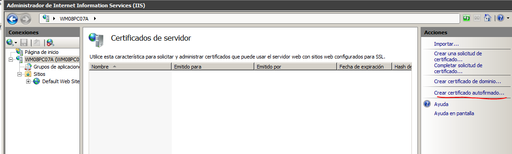

# Instalacion y configuracion https en iis
 Una vez instalado el iis, nos meteremos en la configuracion de este e iremos a la seccion de certificados del servidor

Crearemos un nuevo certificado autofirmado

Iremos rellenando los datos segun nos los pida, el primer paso es el nombre del certificado

Y veremos que se ha creado

Ahora creamos un sitio nuevo y en la configuracion del sitio nos aseguraremos de poner tipo `https` y seleccionar el certificado correspondiente.

Como vemos al acceder desde el cliente nos da una alerta de certificado (porque es autofirmado)

 
