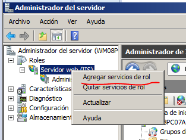
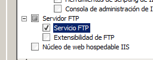
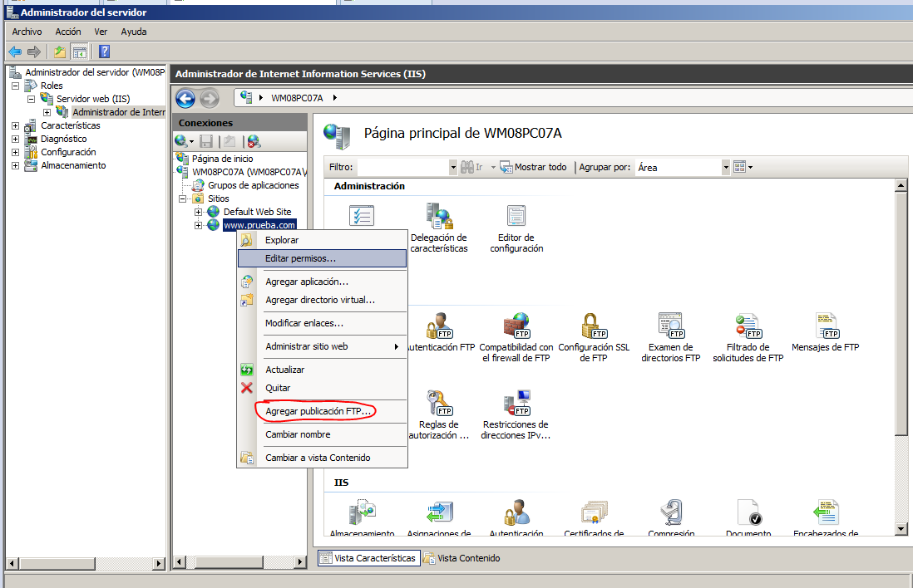
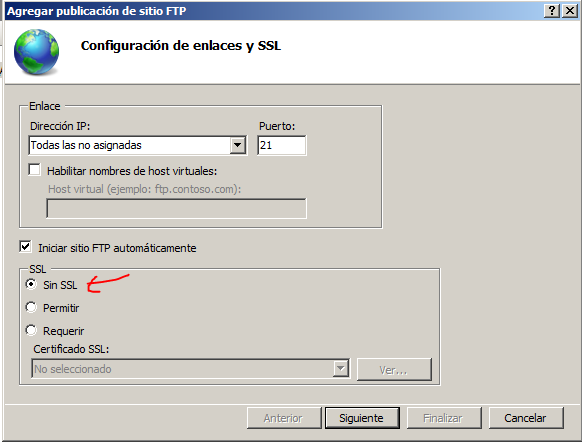
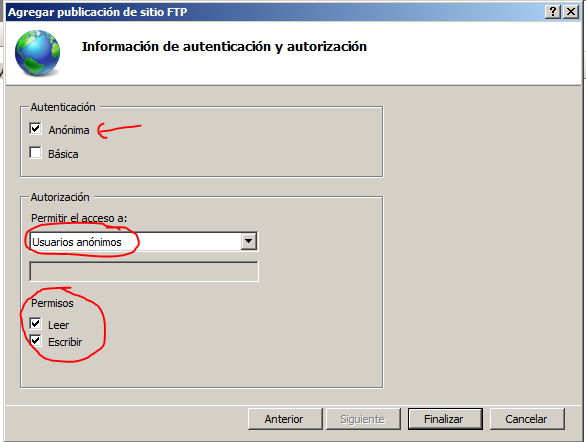
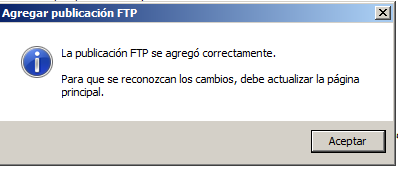
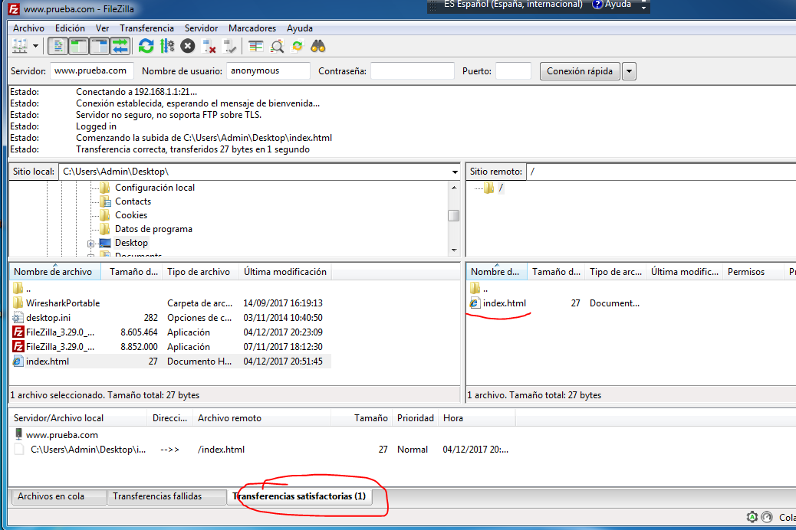

Para añadir a un sitio web el servicio ftp, primero tendremos que añadir el servicio de rol.

Seleccionamos el servicio ftp y continuamos con el asistente.

Una vez hecho esto, podremos publicar un nuevo sitio ftp en las paginas que tengamos.

En este ejemplo, vamos a configurarlo sin ssl, asi que marcaremos la opcion.

Ahora configuraremos los usuarios que queremos que entren y sus permisos, en esta practica vamos a seleccionar usuarios anonimos con permisos de lectura y escritura, cosa que es totalmente desaconsejable.

Y podremos ver el mensaje de configuración correcta.

Ahora desde el cliente, nos conectamos por ftp y probamos a subir un fichero

