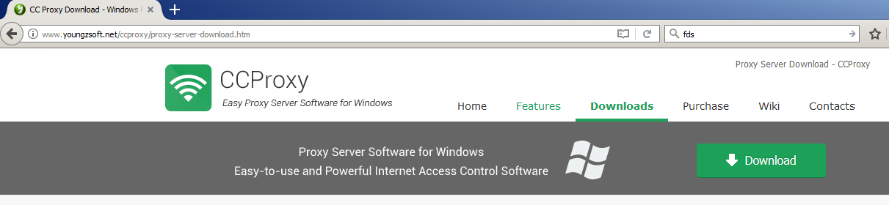
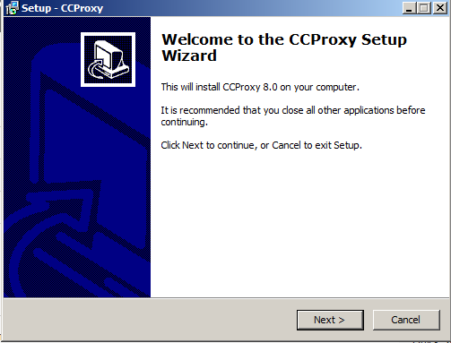
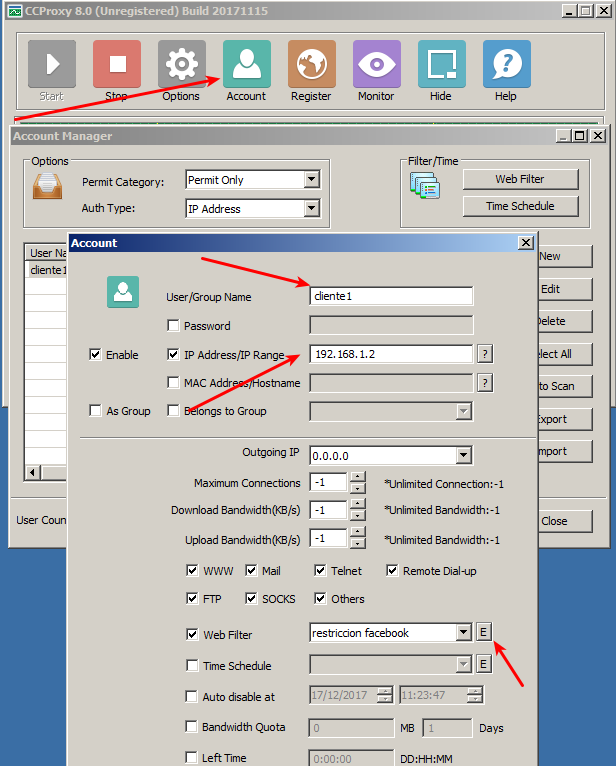
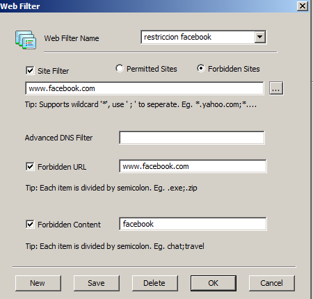
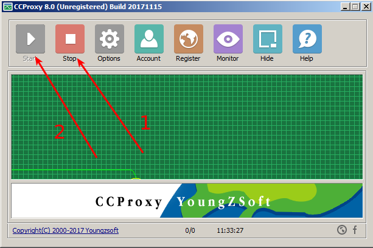
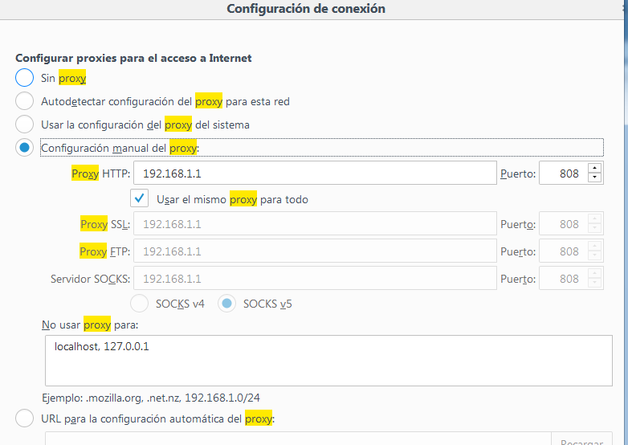
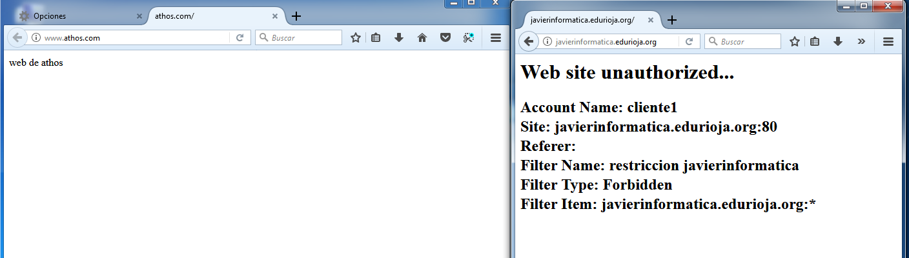
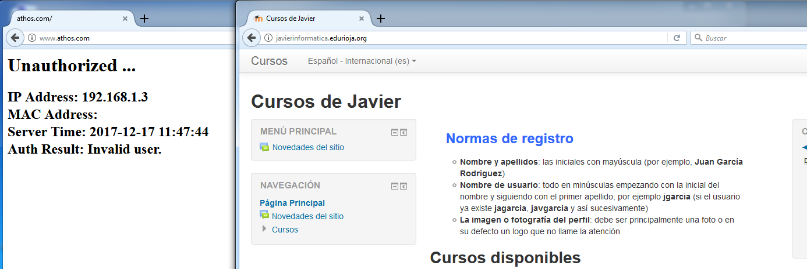
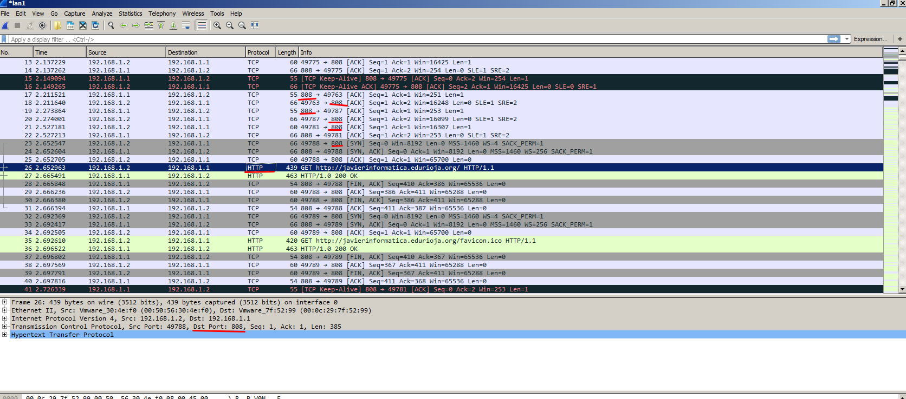
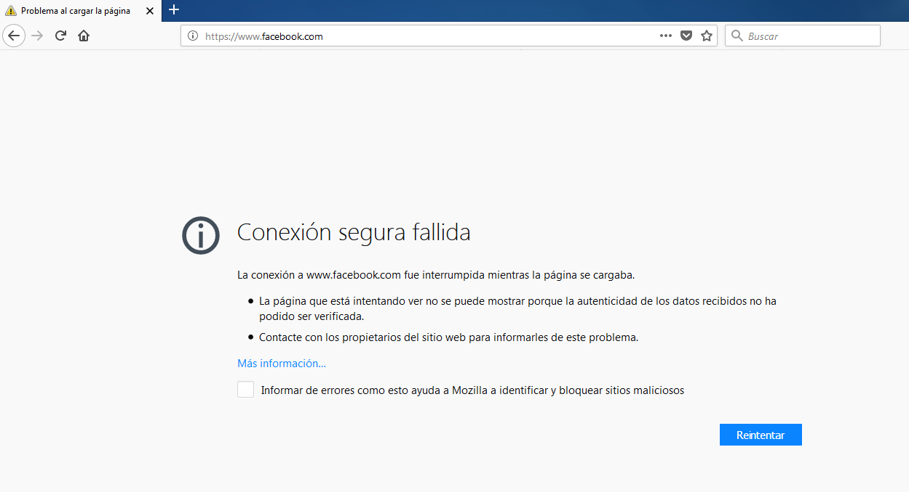

Lo primero descargaremos `ccproxy` desde su página oficial.

Lo instalamos.

Ahora, tendremos que configurar una cuenta, pondremos el usuario (para diferenciar unos de otros), pondremos su direccion ip (también lo podemos hacer por mac), y pincharemos en el boton `E` que hay en webfilter

En esta ventana configuraremos la url que no queremos permitir.

Ahora reiniciaremos ccproxy

En el cliente configuraremos el proxy con los siguientes datos

Y comprobaremos si podemos navegar a javierinformatica y a nuestra pagina desde el cliente 1

En ccproxy, añadiremos una nueva cuenta para el cliente2, esta vez, bloquearemos www.athos.com pero no javierinformatica

Como podemos comprobar, todas las peticiones del cliente van al puerto 808 que es el que configuramos en el proxy (en realidad no lo configuramos, es el que viene por defecto en ccproxy)

Nota: Si realizamos el proceso con una página https, no podremos verla ya que el certificado que nos da el servidor final (www.facebook.com en este ejemplo) no corresponde con el que nos da el servidor.

