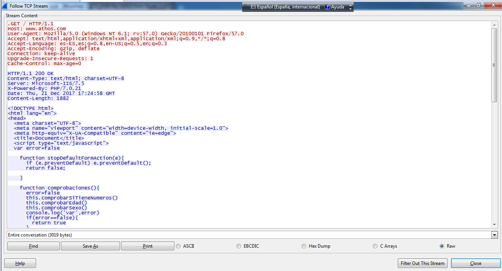

# Práctica PO 0505 Servidor IIS+PHP

## Esquema de red

## Desarrollo

### Método Get

Capturamos los datos enviados por metodo get de un formulario.

Como podemos observar, obtenemos el cuerpo del html, incluido el codigo javascript.

Como se puede observar en la primera linea en rojo, la peticion se hace por metodo get, y podemos observar tanto en wireshark como en la captura de la web, los parametros pasados por url

### Método Post

En cambio, si modificamos el formulario y ponemos el metodo post, no se envian los parametros por url (aunque en ralidad se envian igualmente en las cabeceras del paquete.). La unica diferencia es que no se ven en la url del navegador.

